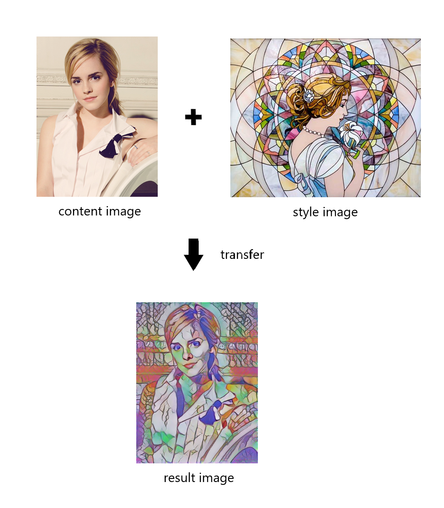

# 이미지에 화가의 화풍 입히기
유명화가의 작품을 선택하여, 해당 작품의 화풍으로 이미지를 변환시켜주는 프로그램입니다.

### 기능 소개
tensorflow 및 tensorflowhub - magenta/arbitrary-image-stylization-v1-256 모델을 활용하여 이미지를 유명화가의 작품의 화풍으로 변환시켜준다.




## How To Use
프로젝트 경로로 이동하여 다음 명령어를 입력한다.
``` shell
python style_transfer.py --content_img="./image/content/sample.png" --style_img="./image/portrait/sample_1.jpg"
```

### 파라미터 옵션 설정
 * --content_img=[컨텐츠 이미지 경로]
 * --style_img=[스타일 이미지 경로]
 * --output_img=[결과 이미지 경로]
 * --resize_width=[결과 이미지 크기]
 * --model=[모델 버전]

## 실행 환경
다음 환경 및 모듈이 설치되어야 프로그램을 실행 할 수 있습니다.
### 언어
- Python 3.8 이상
### 사용 모듈
- TensorFlow 2.2 이상
- TensorFlow_Hub
- numpy
- pillow

## 출처
* 모듈 v1 : [magenta/arbitrary-image-stylization-v1-256/1](https://tfhub.dev/google/magenta/arbitrary-image-stylization-v1-256/1)
* 모듈 v2 : [magenta/arbitrary-image-stylization-v1-256/2](https://tfhub.dev/google/magenta/arbitrary-image-stylization-v1-256/2)